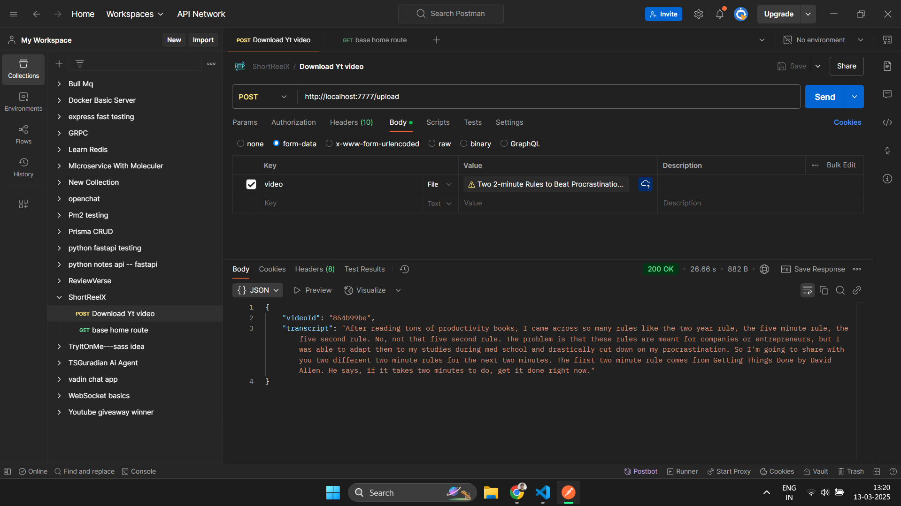
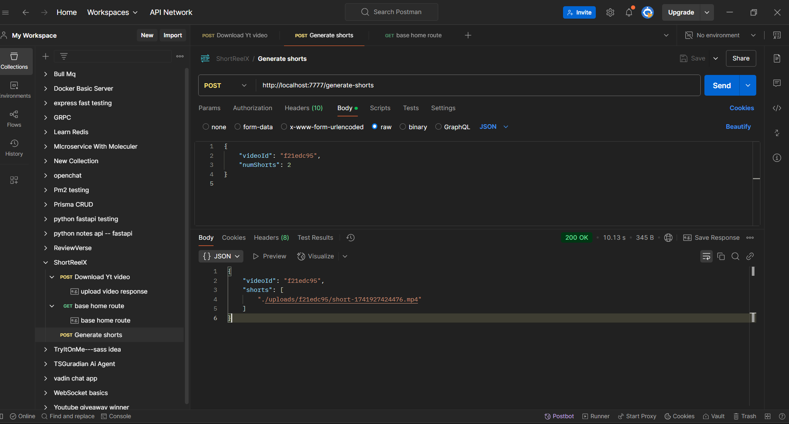
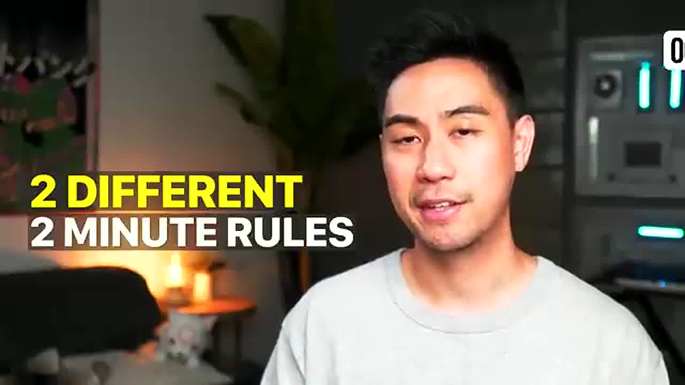
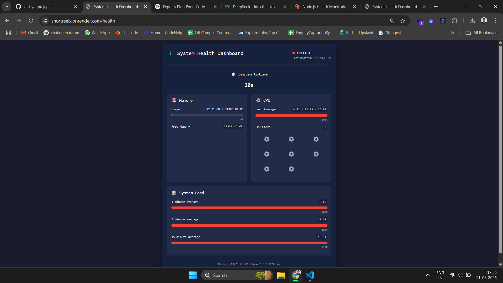

# ShortReelX

ShortReelX is an AI-powered tool that transforms long videos into engaging YouTube Shorts, Instagram Reels, and other social media clips with maximum impact and virality.

## Features
- Upload long-form videos
- Extract transcripts using AI
- Generate short clips from key moments
- Ideal for content repurposing

---
# ShortReelX 
is a fusion of three powerful words:

###### Short → Represents YouTube Shorts and short-form video content.
###### Reel → Represents Instagram Reels, TikTok videos, and other short video formats.
###### X → Symbolizes AI, innovation, and limitless possibilities (like SpaceX, OpenAI, etc.).


---
### Live Link ->> https://shortreelx.onrender.com/
---

## Installation & Setup

### Prerequisites
Ensure you have the following installed:
- [Node.js](https://nodejs.org/) (v16+ recommended)
- [FFmpeg](https://ffmpeg.org/download.html) (for video processing)
- [Git](https://git-scm.com/)

### Clone the Repository
```sh
git clone https://github.com/kashyapprajapat/ShortReelX.git
cd ShortReelX
```

### Install Dependencies
```sh
npm install
```

### Configure Environment Variables
Create a `.env` file in the project root and configure it as needed:
```env
PORT=7777
# Add other necessary configurations
```

### Start the Server
```sh
npm start
```
The server will start at `http://localhost:7777/`.

---

## API Endpoints

### 1. Upload a Video
**Endpoint:** `POST /upload`

**Request:**
- FormData (video file)

**Response:**
```json
{
  "videoId": "unique-id",
  "transcript": "Extracted text from video"
}
```

// Upload endpoint response



### 2. Generate Shorts
**Endpoint:** `POST /generate-shorts`

**Request Body:**
```json
{
  "videoId": "unique-id",
  "numShorts": 3
}
```

**Response:**
```json
{
  "videoId": "unique-id",
  "shorts": ["path-to-short1.mp4", "path-to-short2.mp4"]
}
```


// Generate shorts response



### 3. Generate Exciting Thumbnails
**Endpoint:** `POST /getexcitingthumbnails`
**Request:
FormData with:**
```json
video (file): Video to extract thumbnails from
numThumbnails (number): Number of thumbnails to generate (1-3)
```


**Process:**
```
AI analyzes video content to find visually compelling moments
Applies enhancement filters (brightness, contrast, sharpening)
```
// Generated thumnaials pick



---

## Forking the Project
If you want to contribute or customize the project, follow these steps:

1. **Fork the Repository**
   - Click the **Fork** button on the [GitHub repo](https://github.com/kashyapprajapat/ShortReelX).

2. **Clone Your Fork**
   ```sh
   git clone https://github.com/kashyapprajapat/ShortReelX.git
   cd ShortReelX
   ```

3. **Create a New Branch**
   ```sh
   git checkout -b feature-branch
   ```

4. **Make Your Changes & Commit**
   ```sh
   git add .
   git commit -m "Your changes"
   ```

5. **Push Changes to Your Fork**
   ```sh
   git push origin feature-branch
   ```

6. **Submit a Pull Request**
   - Go to your forked repo on GitHub
   - Click on **Pull Request** > **New Pull Request**
   - Select your branch and submit the PR for review

---

## Contributing
Contributions are welcome! Feel free to fork, improve, and submit a PR.

---




#### Approach 1 👨🏻‍💻
##### Taking url download it but tenserflow not compatible and have meemoory leack use so now try v2
##### in v1 my pov based on yt video sfter downloding it we capature high anaging movement on yt video using tenserflow but it have node22 support so i degrded to node 16/18 still not working and give smae npm error memmory leak issue .. so now trying v2

---

---

#### Approach 2 👨🏻‍💻
##### my approch is thaat first download the video and generate the caption of it and now give that caption to gemai or any llm model based on that it will give use high chanses of that more views on ytshorts according  youtube shorts rules like (verticall,must be a 9:16 aspect ratio etc)  to that it will retunt the time stemp and based on that time step we will crop that part using ffmpeg and give it tot he user 


